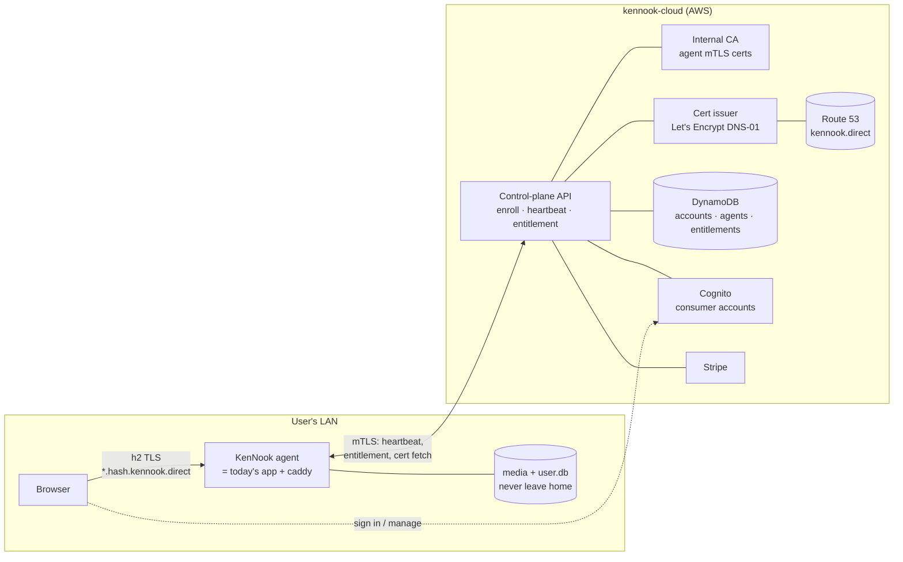
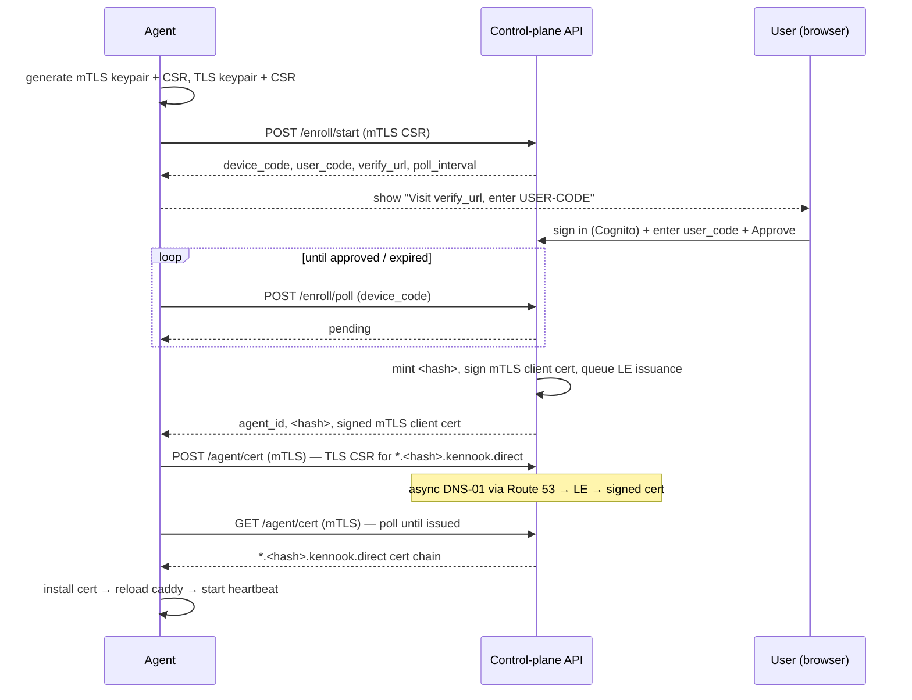

# Phase 0 — The Cloud Spine (Enrollment · Cert · Heartbeat · Entitlement)

**Status:** Draft · **Owner:** solo · **Last updated:** 2026-08-10
**Repos:** control plane → `kennook-cloud` (separate AWS) · agent changes → `kennook`

---

## 1. What Phase 0 is

Phase 0 builds the **trunk** that every paid pillar (cloud AI brain, remote access,
metadata sync) hangs off of, and nothing more. Concretely it delivers:

1. A **consumer account** at kennook.com with membership/billing (Stripe).
2. **Agent enrollment** — a local KenNook instance pairs to an account and gets a
   durable identity (an mTLS client cert).
3. A **`*.<hash>.kennook.direct` wildcard TLS cert** per agent, so browsers reach
   the LAN instance over real, no-warning HTTPS/**h2**.
4. A **heartbeat** — the agent reports IP + version + health and pulls
   entitlements; the cloud keeps the agent's DNS current.
5. An **entitlement + metering** interface — gate features on membership, and a
   usage-recording seam wired in from day one (even though nothing is metered yet).

**Immediate user-facing win:** #3 fixes today's HTTP/1.1 six-connection wall
(no cert warning + h2 multiplexing), which is why we started down this road.

**Everything else is deferred** — see [§14 Non-goals](#14-non-goals-for-phase-0).

---

## 2. The non-breaking contract (hard requirement)

This section is load-bearing. Phase 0 must not put the stable, shipped app at risk.

> **Cloud-optional invariant.** KenNook stays 100% functional with **zero cloud
> contact**. Not enrolled, or cloud unreachable → the app behaves **exactly** as it
> does today (LAN-only, current serving path). A cloud outage may degrade *premium*
> features; it must **never** degrade the core, and must **never** brick the app.

Enforcement rules, all testable:

| # | Rule | How it's enforced |
|---|------|-------------------|
| C1 | Control plane is a **separate deploy surface** | Lives in `kennook-cloud` / separate AWS. Building it cannot touch the shippable binary. |
| C2 | Every cloud subsystem is **flagged, default OFF** | `cloud.enabled=false` by default in app-config; a kill switch disables the whole client. |
| C3 | **Additive-only** `user.db` migrations | New tables only (§10.2). Core never reads them; dropping them leaves the app working. |
| C4 | Cert issuance is **decoupled** from the http2 rewrite | The existing instance keeps **caddy**; the cert is a config drop-in. Native-http2 termination is *not* Phase 0. |
| C5 | **Offline is a first-class tested path** | CI/dogfood runs the app with the cloud unreachable and asserts core behavior is unchanged. |
| C6 | Entitlement has a **grace window**; core never checks it | Paid features tolerate a multi-day cloud outage; the core library has no entitlement dependency at all. |

If any Phase-0 change cannot satisfy C1–C6, it doesn't ship in Phase 0.

---

## 3. Architecture at a glance

Two planes. The **local agent is today's app**; the cloud bolts on.



**What crosses the boundary in Phase 0:** account identity, agent metadata, the
agent's IP addresses, app version, and cert material (CSR in, signed cert out —
private key **never** leaves the agent). **What does not:** media, thumbnails,
tags, ratings, embeddings — none of it. (Those belong to later phases and will be
opt-in and bounded.)

---

## 4. Two cert systems (don't conflate them)

A frequent source of confusion — Phase 0 uses **two independent** cert systems:

| | Internal CA (KenNook) | Let's Encrypt |
|---|---|---|
| Issues | **Agent client certs** (mTLS) | **Server certs** `*.<hash>.kennook.direct` |
| Purpose | Authenticate agent → cloud | Authenticate agent → browser |
| Trust | Private (only the cloud trusts it) | Public (every browser trusts it) |
| Key custody | Agent generates keypair; CA signs CSR | Agent generates keypair; LE signs CSR |
| Lifetime | Long (e.g. 1–2 yr), revocable | 90 days, auto-renewed at day ~60 |

In both cases the **private key is generated on and never leaves the agent**; the
cloud only ever sees a CSR and returns a signed public cert.

---

## 5. The `.kennook.direct` cert scheme

Plex's mechanism, adopted directly.

- Each agent gets a stable **`<hash>`** (opaque, e.g. 32 hex chars) at enrollment.
- Its wildcard cert is **`*.<hash>.kennook.direct`**.
- A browser reaches it at **`<dashed-ip>.<hash>.kennook.direct`**, e.g.
  `192-168-1-50.ab12…ef.kennook.direct`, which resolves to `192.168.1.50`.
- Because the cert is a wildcard over `<hash>.kennook.direct`, the **same cert
  covers every interface** — each LAN IP, and the public IP for remote later.
- **Per-agent** wildcard (not one shared wildcard) so each agent has its **own
  private key**: a leak compromises one agent, not the fleet.

### 5.1 DNS — Phase 0 keeps it on Route 53 (no custom DNS server)

We do **not** need an IP-decoding resolver for Phase 0, because the agent tells us
its IPs on every heartbeat:

1. Agent enumerates its local IPv4 interfaces and sends them in the heartbeat.
2. Cloud derives the **public IP** from the heartbeat's source address.
3. Cloud writes/updates Route 53 **A records**:
   `192-168-1-50.<hash>.kennook.direct → 192.168.1.50` for each reported IP.
4. **ACME DNS-01** TXT challenges for `_acme-challenge.<hash>.kennook.direct` are
   published via the Route 53 API (lego/certbot Route 53 provider).

**Scale note (tracked, not a Phase-0 blocker):** two limits appear as the beta
grows — (a) Let's Encrypt's ~50 certs/registered-domain/week, and (b) Route 53's
default 10k records/zone. Both are fine for dogfood + small beta. When they bite:
move issuance to a high-volume CA (ZeroSSL / Google Trust Services) and/or replace
the per-agent A records with a self-hosted **IP-decoding resolver** (sslip.io-style)
for `kennook.direct`. Flagged as an open decision (§15), deliberately out of scope now.

### 5.2 Consuming the cert on the existing instance (contract rule C4)

The agent writes the issued cert + key to its data dir and points **caddy** at it
(a `tls <cert> <key>` drop-in on the relevant site block), then reloads caddy.
**No change to how the app serves** — caddy already terminates TLS today; we're
only swapping in a publicly-trusted cert for a hostname that resolves to the LAN
IP. Non-enrolled instances are untouched.

Native in-process http2 termination (for consumers who won't run caddy) is
**Phase-0-adjacent, not Phase 0** — it's consumer-packaging work and is specced
separately so it can't destabilize the running app.

---

## 6. Enrollment — OAuth 2.0 Device Authorization Grant

The standard, correct pattern for pairing a headless-ish device to an account.



Notes:
- `user_code` is short, human-typeable, single-use, rate-limited, and expires fast.
- After enrollment, **all** agent→cloud calls are **mTLS** with the client cert.
- The two CSRs (mTLS identity, TLS server) are separate keypairs (§4).

---

## 7. Heartbeat

- **Transport:** `POST /agent/heartbeat`, mTLS-authenticated.
- **Cadence:** ~60s (jittered). Backoff on failure; never tight-loops.
- **Owner:** exactly **one** loop per instance. Given the two-process topology
  (prod `:3001` + dev `:3000` both draining one `user.db`), the loop runs under a
  DB-lease singleton (same idea as the SSE leader) so we don't double-heartbeat.
- **Request:** `{ version, buildId, health, ipv4[] }` (public IP derived server-side).
- **Response:** `{ entitlements, entitlementsTtl, commands[] }`.
- **Cloud side-effects:** upsert Route 53 A records if IPs changed; refresh
  `lastSeenAt`; return current entitlements + any commands.
- **Commands (Phase 0 set):** `renew-cert`, `deprovision`, `noop`. (Richer
  Control-Center commands come later — the channel exists now.)

---

## 8. Entitlement & metering

### 8.1 Entitlement
```
Entitlement {
  membershipActive: boolean
  tier: 'free' | 'member'
  features: { [key: string]: boolean }   // e.g. remoteAccess, cloudAI, metadataSync
  limits:   { [key: string]: number }    // reserved for metered caps
}
```
- Source of truth: DynamoDB, updated by **Stripe webhooks** (subscription created /
  updated / canceled → recompute entitlement).
- Agent caches the last entitlement with `entitlementsTtl` + a **grace window**
  (e.g. 7 days) so a cloud/Stripe outage doesn't disable paid features (C6).
- **The core never reads entitlement.** Free = the full self-hosted app.

### 8.2 Metering (interface now, counters later)
Per the "bake metering in from day one" principle. Phase 0 ships the **seam**, not
the accounting:
- A `recordUsage(accountId, meter, quantity)` API + DynamoDB counter table.
- Phase 0 callers: none (or a smoke-test meter). Phases 1–3 record relay GB, AI
  inference units, sync volume against it.
- Rationale: retrofitting metering after free-unlimited features ship is painful,
  and it's the control that protects margins.

---

## 9. Cloud control plane (AWS) — resumes the paused CDK work

Lean on managed services; keep the plane thin (solo-dev ops burden).

| Concern | Choice | Why |
|---|---|---|
| Consumer identity | **Cognito user pool** | Managed sign-up/verify/MFA; integrates with API GW |
| API | **API Gateway (HTTP) + Lambda** | Serverless, per-request; mTLS via custom authorizer / ALB-mTLS |
| Datastore | **DynamoDB** | Simple per-account access patterns; serverless |
| Internal CA | **Lambda + KMS-held CA key** (or AWS Private CA) | Sign agent mTLS certs; evaluate Private CA cost |
| Public cert issuer | **lego (Route 53 DNS-01)** in an async worker | `*.<hash>.kennook.direct` from Let's Encrypt |
| DNS | **Route 53** hosted zone `kennook.direct` | A records + ACME TXT |
| Cert storage | Issued cert (public) in DynamoDB/S3; **no private keys** | Agent holds its own keys |
| Billing | **Stripe** + webhook Lambda | Subscriptions → entitlement |
| Secrets | **Secrets Manager / KMS** | CA key, Stripe keys, LE account key |
| Observability | CloudWatch | Control-plane metrics/alarms |

Cert issuance is async (DNS-01 needs a propagation wait): enrollment enqueues a job
(SQS → worker Lambda, or Step Functions with a wait state); the agent polls
`GET /agent/cert` until ready.

---

## 10. Local agent changes (`kennook` repo) — thin, flagged, additive

### 10.1 New module `src/server/cloud/`
- `enrollment.ts` — device-code flow, keypair/CSR generation, cert install (caddy reload).
- `heartbeat.ts` — the singleton loop (DB-lease owner), IP enumeration.
- `entitlements.ts` — cached read with grace; `isEntitled(feature)` returns
  `false` cleanly when cloud is disabled/unreachable.
- `client.ts` — mTLS HTTP client to the control plane.
- All no-op when `cloud.enabled=false`.

### 10.2 Additive `user.db` tables (C3)
- `cloud_enrollment` — `agent_id, hash, account_ref, mtls_cert, enrolled_at`.
- `cloud_entitlements_cache` — `payload_json, fetched_at, ttl`.
No changes to existing tables. Core queries never touch these.

### 10.3 Admin UI
- A **"Connect to KenNook Cloud"** screen (opt-in): shows the `user_code` +
  verify URL, then enrollment status, cert status, and a **Disconnect** action.
- Hidden entirely unless the operator opts in.

### 10.4 Config
- `cloud.enabled` (default `false`), `cloud.apiBase`, kill-switch env override.

---

## 11. Security model

- **Agent auth:** mTLS after enrollment; client cert from the internal CA.
- **Key custody:** all private keys (mTLS + TLS server) generated on and confined
  to the agent's data dir; the cloud sees only CSRs.
- **Pairing:** device-code flow with short-lived, rate-limited, single-use codes.
- **Revocation / deprovision:** operator revokes an agent in the dashboard →
  cloud stops cert renewal, revokes the mTLS cert, and returns `deprovision` on the
  next heartbeat → **agent reverts to local-only and keeps working** (C1/C6).
- **Data minimization (Phase 0):** identity, agent metadata, IPs, version, cert
  material only. No media/metadata.
- **Public Suffix List:** submit `kennook.direct` to the PSL eventually (cookie
  isolation between agents), à la `plex.direct` — not required for Phase 0.

---

## 12. Failure modes & degradation (all → "today's behavior", never worse)

| Failure | Behavior |
|---|---|
| Cloud API unreachable | Agent serves with existing cert; entitlements from cache+grace; core unaffected. |
| Cert renewal fails | Keep current cert until expiry (renew starts ~30 days early → wide buffer); alert. On expiry with no cloud: fall back to prior serving (self-signed/http) — **never brick**. |
| Enrollment revoked | Agent reverts to local-only, keeps serving. |
| Route 53 / DNS hiccup | Existing cert valid; resolvers serve last-known records (TTL). |
| Stripe webhook lag | Entitlement grace window covers it. |
| Both Node processes running | DB-lease singleton ensures one heartbeat owner. |

---

## 13. Rollout

1. Stand up `kennook-cloud` CDK skeleton in the **separate AWS account** (resumes
   the paused infra work — this is the reason to un-pause it).
2. **Dogfood on the operator's own instance** first (it has caddy → cert drop-in).
3. Ship behind `cloud.enabled` + kill switch; invite a small beta.
4. Assert the offline path (C5) in CI and manually before each cloud change.

---

## 14. Non-goals for Phase 0

Explicitly deferred so scope can't creep into a rewrite:
- Remote-access **relay** and NAT traversal (Phase 2).
- **Metadata sync** / cloud backup (Phase 1).
- **Cloud AI** brain (Phase 3).
- **Cloud-hosted UI** (`app.kennook.com`).
- **Native http2** termination / consumer installer / packaging.
- Mobile apps, sharing links.

---

## 15. Open decisions (need a call before/within build)

1. **Domain:** register **`kennook.direct`**? (Plex uses a dedicated `.direct`.)
   Fallback: a subdomain like `*.d.kennook.ai` on the existing Route 53. Decide
   before DNS work.
2. **Consumer auth:** **Cognito** vs. roll-your-own. Leaning Cognito (managed).
3. **Internal CA:** self-managed **Lambda+KMS** vs. **AWS Private CA** (simpler,
   costs ~$400/mo — likely overkill at beta scale).
4. **CA at scale:** when Let's Encrypt's per-domain weekly limit bites, which
   high-volume CA? (ZeroSSL / Google Trust Services.)
5. **DNS at scale:** stay on Route 53 A-record churn, or move to a self-hosted
   IP-decoding resolver? (Deferred; A-records for Phase 0.)
6. **Heartbeat owner:** confirm the DB-lease singleton approach vs. binding the
   loop to the prod process only.

---

## 16. Build milestones (within Phase 0)

- **M0** — `kennook-cloud` CDK skeleton; Route 53 zone; DynamoDB; API GW + Lambda hello.
- **M1** — Cognito accounts; kennook.com sign-up/sign-in.
- **M2** — Enrollment (device-code) + internal CA + mTLS.
- **M3** — Cert issuance (LE DNS-01 via Route 53) + A records + agent cert install (caddy).
- **M4** — Heartbeat + entitlement + Stripe billing + metering seam.
- **M5** — Agent integration behind flag + admin enrollment UI + offline-path tests (C5).

Each milestone is independently demoable; none touches the core serving path of a
non-enrolled instance.
